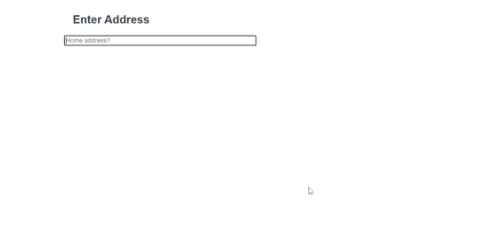

# Vue Address Component

A Vue.js component for address autosuggest using Google Maps Places API.

## Table of contents

- [Browser Support](#browser-support)
- [Demo](#demo)
- [Installation](#installlation)
- [Getting started](#getting-started)
- [Usage](#usage)
- [Available Props](#available-props)
- [Methods](#methods)
- [Want to Contribute?](#want-to-contribute)
- [Need Help / Support?](#need-help)
- [Collection of Components](#collection-of-components)
- [Changelog](#changelog)
- [Credits](#credits)
- [License](#license)
- [Keywords](#Keywords)

## Browser Support

 |  |  |  |  |
--- | --- | --- | --- | --- | --- |
83.0 ✔ | 77.0  ✔ | 13.1.1 ✔ | 83.0 ✔ | 11.9 ✔ |

## Demo

[](https://github.com/weblineindia/Vue-Address-Autosuggest/address.gif)

## Installation

This component uses Google Maps Places API to get geo suggestions for address autocompletion. To use this component, you have to include the Google Maps Places API in the `<head>` of your HTML:

```html
<!DOCTYPE html>
  <html>
  <head>
    …
    <script src="https://maps.googleapis.com/maps/api/js?key=YOUR_API_KEY_HERE&libraries=places"></script>
  </head>
  <body>
    …
  </body>
</html>
```

To obtain API key please visit the [Google Developer Console](https://console.developers.google.com). The API's that you have to enable in your Google API Manager Dashboard are [Google Maps Geocoding API](https://developers.google.com/maps/documentation/geocoding/start), [Google Places API Web Service](https://developers.google.com/places/web-service/) and [Google Maps Javascript API] (https://developers.google.com/maps/documentation/javascript/).

## Getting started

Install the npm package:

``` bash
npm install vue-weblineindia-address
#OR
yarn add vue-weblineindia-address
```

## Usage

Use the `<vue-weblineindia-address>` component:

```vue
<template>
    <div>
    <h2>Enter Address</h2>
    <div  v-for="(address, akey) in registration.address" :key="address.key">
      <div id="input-group-1">
        <Address
          id="address"
          name="address"
          :tabindex="0"
          placeholder="Address"
          :index="akey"
          :is-multiple="true"
          :is-show-plus="registration.address.length - 1 === akey"
          :on-multiple-address-add="onMultipleAddressAdd"
          :address-value="registration.address"
          :hide="false"
          :disabled="false"
          :selected-countries="['in']"
          @change="onChange"
          :isShowStreetField="true"
        />
         <span v-if="address.isDuplicate">
            <p
              :class="{
                control: true,
                'text-center': true,
                'error-msg': true,
              }"
            >
              <span>
                <span>Do not enter the same address</span>
              </span>
            </p>
          </span>
      </div>
    </div>
</template>

<script>
    import Address from 'vue-weblineindia-address'
    export default {
        components: { Address },
        data(){
           return{
            registration: {
            address: [
                {
                address: "",
                geolocation: { x: 0, y: 0 },
                country: "",
                locality: "",
                postalcode: "",
                state: "",
                province: "",
                fulladdress: "",
                streetaddress: "",
                isDuplicate: false,
              }
            ]
            }
           }
        },
        methods: {
            /**
            * This method used for multiple address 
            */
            onMultipleAddressAdd(){
                let value =  this.registration.address
                this.registration.address.push({value})
            },
        }
    }
</script>
```

## Available Props

| Prop | Type | default | Description |
| --- | --- | --- | --- |
| id | String |   |ID for the input container |
| name | String |   |Name of the component |
| value | Array |  address: [ {address: "", geolocation: { x: 0, y: 0 }, country: "",locality: "",postalcode: "", state: "",province: "",fulladdress: "", streetaddress: "",isDuplicate: false}]  | Value of the component |
| classname | String |   |  Class to the input container |
| streetPlaceholder | String |   | The input field will get this placeholder text |
| isShowStreetField | Boolean | false  | hide /show street number field |
| placeholder | String |   | The input field will get this placeholder text ||
| selectedCountries | `Array` | null  |  Option to restrict the autocomplete search to a particular country. Countries must be passed as a two-character, ISO 3166-1 Alpha-2 compatible country code (i.e. "br", "sg", "fr"). You can provide a single one, or an array of up to 5 country code strings. |
| hide | Boolean | false  | Hide component  |
| disabled | Boolean | false  | Disable component  |
| tabindex | Number |   | Tab index of the component  |
| isMultiple | Boolean |   | Add Multiple Address  |
| isShowPlus | Boolean |   | Show + icon  |
| index | Number |   | Add key of the component  |
| maxlength | Number |   | The input maxlength  |

## Methods

| Name | Description |
| --- | --- |
| focus | Gets triggered when the autocomplete input field receives focus. |
| blur | Gets triggered when the autocomplete input field loses focus. |
| inputChange | Gets triggered every time autocomplete input got changed. |
| onMultipleAddressAdd | Gets triggered every time when add plus icon  |
| change | Gets triggered when the autocomplete results got changed. |
| keypress | Gets triggered when a key gets pressed. |
| error | Gets triggered when an error is encountered. |
| placechanged | Gets triggered when the address data got obtained. This data is available on the returned objects: `street_number`,`route`, `locality`, `administrative_area_level_1`, `country`, `postal_code`, `latitude`, `longitude`. `place` - [PlaceResult object](https://developers.google.com/maps/documentation/javascript/reference#PlaceResult) is available as second parameter.`id` a String representing the ID of the autocomplete that triggered the event. |

## Want to Contribute?

- Created something awesome, made this code better, added some functionality, or whatever (this is the hardest part).
- [Fork it](http://help.github.com/forking/).
- Create new branch to contribute your changes.
- Commit all your changes to your branch.
- Submit a [pull request](http://help.github.com/pull-requests/).

-----

## Need Help? 

We also provide a free, basic support for all users who want to use this VueJS Address Component in their software project. In case you want to customize this Address Component to suit your development needs, then feel free to contact our [VueJS developers](https://www.weblineindia.com/hire-vuejs-developer.html).

-----

## Collection of Components
We have built many other components and free resources for software development in various programming languages. Kindly click here to view our [Free Resources for Software Development](https://www.weblineindia.com/software-development-resources.html )

------

## Changelog

Detailed changes for each release are documented in [CHANGELOG.md](./CHANGELOG.md).

## Credits

vue-weblineindia-address is inspired by [Vue Google Autocomplete](https://github.com/olefirenko/vue-google-autocomplete).

## License

[MIT](LICENSE)

[mit]: https://github.com/weblineindia/Vue-Address-Autosuggest/blob/master/LICENSE

## Keywords

vue-weblineindia-address,autocomplete,google,vue components,vuejs,vuejs component
